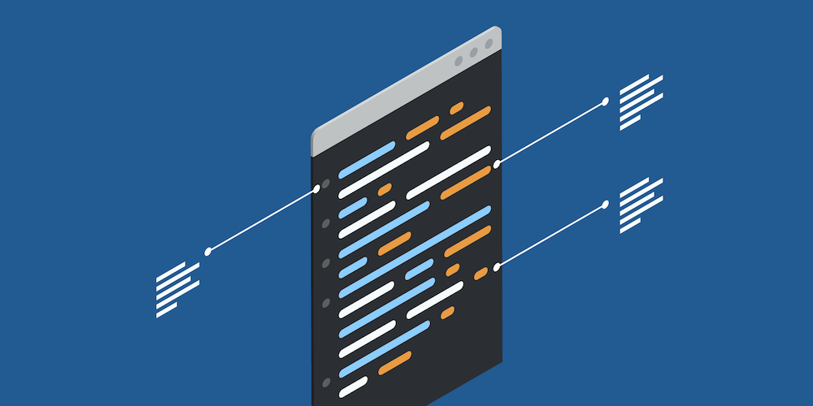
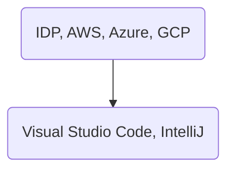

# devex-cloud

repository for the development of the DevEx website:

[]

## Installation

pip install mkdocs-material
pip install "mkdocs-material[imaging]"
pip install mkdocs-git-revision-date-plugin

This section explain the different steps involved in setting up a development environment

