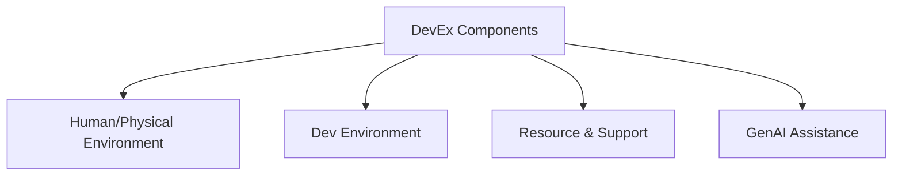

# devex components

## Key Aspects of DevEx

- **Tooling**: The quality and usability of development tools.
- **Processes**: Efficient and streamlined development processes.
- **Environment**: A supportive and collaborative work environment.