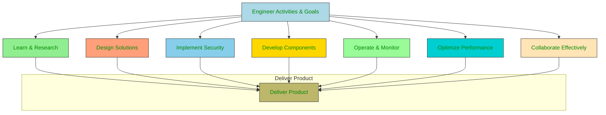
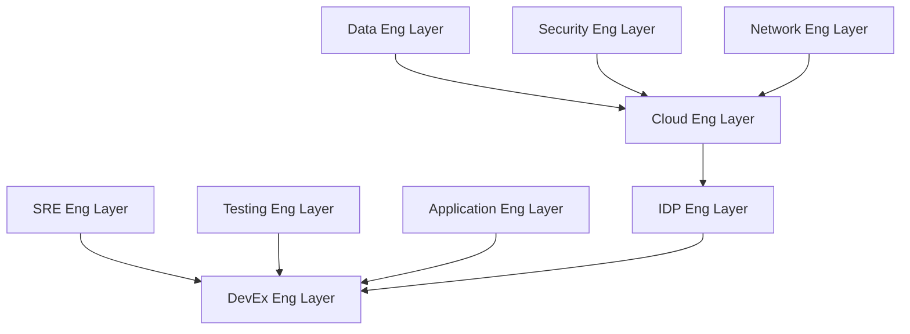
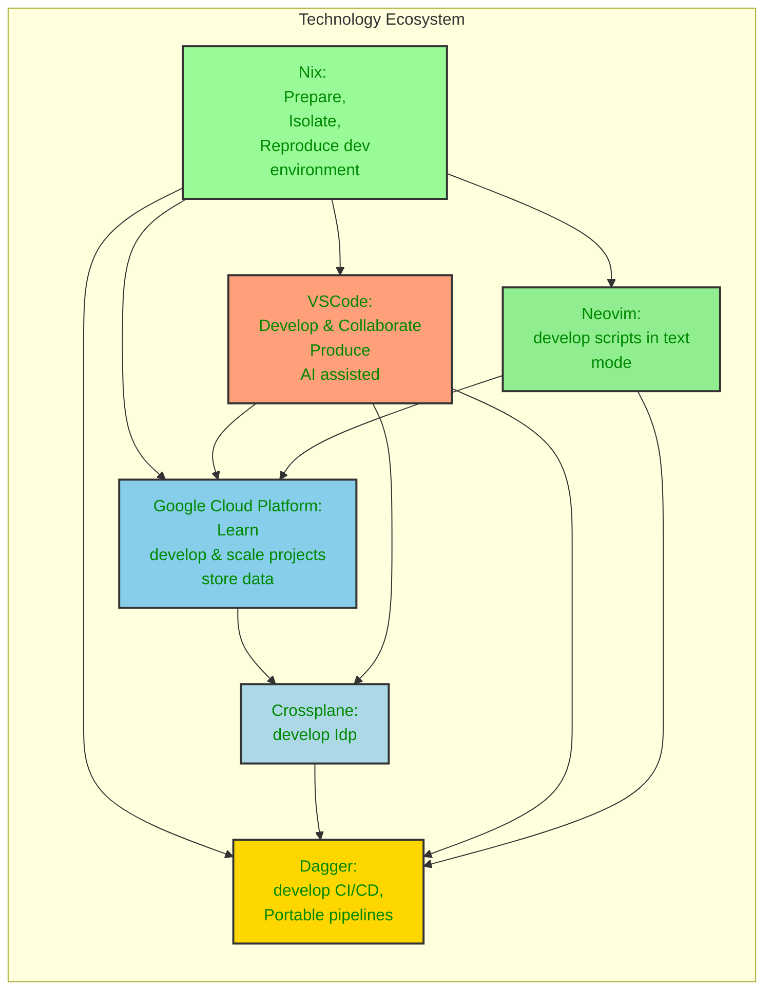

# Homepage

Welcome to my website. This is my personal space where I share my knowledge to improve the productivity through AI assisted tools and cloud engineering.

Today, the developer is at the center of the digital transformation. The developer experience (DevEx) is a key factor in the success of any software project. This website is dedicated to exploring the tools, learning paths, processes, and environments that contribute to a positive DevEx.

The modern developer evolves into a __cloud developer__, driving AI-powered productivity and cloud engineering excellence.

This site explores how to build a modern developer experience (DevEx) within a cloud-native environment, focusing on empowering engineers to deliver high-quality software efficiently and effectively. A good DevEx creates an environment that facilitates learning, design, security, development, operation, optimization, and collaboration, making the final goal of creating and delivering a product more streamlined and easier.

# About me

Solution Engineer.

Developer Advocate focused on improving AI assisted productivity (check contributions & best practices in this website).

Cloud engineering Coach & Expert - Certified Google Professional Architect [(verified)](https://www.credly.com/badges/79018014-8140-4181-8f5c-ed9d167c64bd/public_url).

Data engineering Coach & Expert - Professional Certification on going.

## Core Activities of an Engineer

The diagram below illustrates how all core activities of an engineer, converge to the goal of delivering a software product.

## Different Engineering Layers in a DevEx Focused Organization

In a DevEx focused organization, different engineers contribute to the different parts of the software development cycle. All of them are contributing to the final result by developing the code, or tools that other engineers will use. The different layers interact with each other to provide a complete ecosystem for software development, and have the common goal of delivering a high quality product with a great developer experience.

The goal of this website is to provide insights, best practices, and resources to help you build a modern developer experience that empowers you to deliver high-quality software efficiently and effectively.

In absence of Idp, the application engineer should become a cloud developer to deliver the product. The cloud developer should be able to operate and monitor the application, optimize its performance, and collaborate effectively with the rest of the team.

# Need templates

Templates are starting points for projects. They provide a foundation for building a project, and can help save time and effort by providing a structure that has already been set up. Templates can be used for a variety of projects, from web applications to machine learning models.

The template include:
- A github repository with a README.md file.
- A descrition of :
  - diagram of target architecture.
  - list of technologies used.
  - list of languages used.
- Corresponding vscode profile, snippets, and extensions for used languages.

# My favorite technologies

| Technology    | Why ?                                                                                                                      |
|----------------|-------------------------------------------------------------------------------------------------------------------------------------------------|
| **Google cloud Platform** | Cutting-edge data & AI, serverless; wants open, scalable solutions. Driven by data,  innovation; prefers multi-cloud flexibility.                |
| **Nix**        | Reproducible, reliable, declarative setups. Values functional approach, isolation, and software correctness for any system.                        |
| **Dagger**      | Code-first CI/CD, portable pipelines, containerized. Prefers programmable, composable workflows, fast builds.                |
| **Crossplane** |  Kubernetes API for infra; loves extensible architecture. Wants to control multi-cloud infrastructure as code, with K8s.                       | 
| **VSCode**    | Productive & extensible code editor; a performant & customizable IDE. Wants seamless workflows, collaboration; supports any language.          |
| **Neovim**  |  Ultimate customization, powerful, lightweight, and text-focused code editor. Prefers minimalism, speed, extensibility.              |

