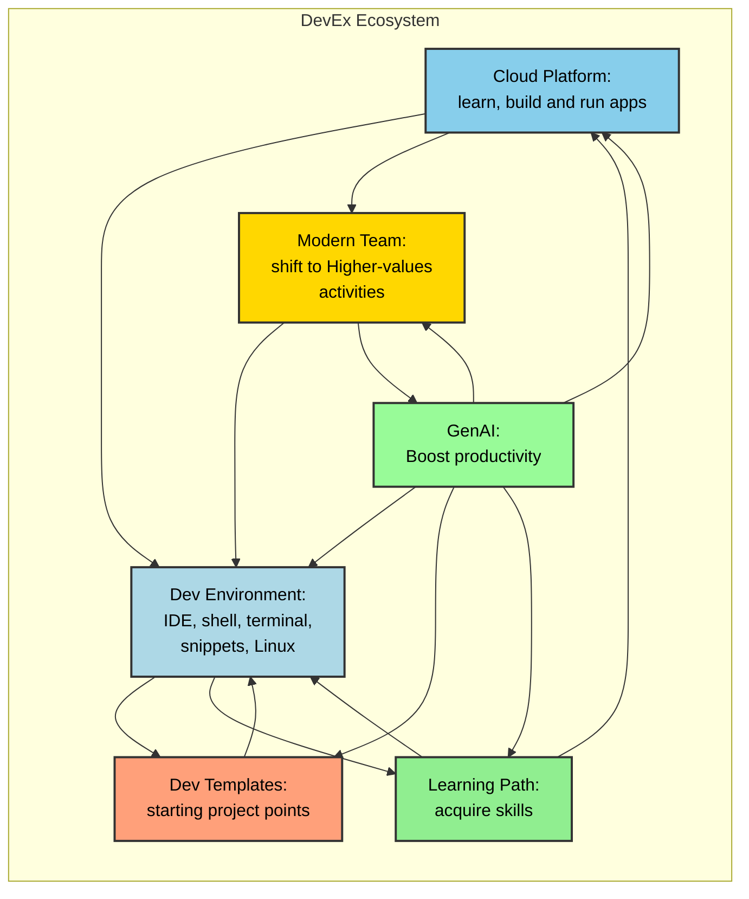

# Homepage

Welcome to my website. This is my personal space where I share my knowledge to improve the productivity through AI assisted tools and cloud engineering.

# About me

Software Engineer.

Developer Advocate focused on improving AI assisted productivity (check contributions & best practices in this website).

Cloud engineering Coach & Expert - Certified Google Professional Architect [(verified)](https://www.credly.com/badges/79018014-8140-4181-8f5c-ed9d167c64bd/public_url).

Data engineering Coach & Expert - Professional Certification on going.

# The DevEx Ecosystem

The following elements are essential for a adopting a Modern Developer Experience (DevEx) within a cloud-native environment.

## Cloud Platform

**Description:** A cloud platform provides the infrastructure for both learning and production environments.

Developers need a place to experiment and learn new cloud technologies (a learning platform) and a reliable, scalable platform to deploy and run their applications (a production platform). This covers the full lifecycle of cloud-native development.

This also implies access to cloud resources, services, and the ability to self-serve in both environments.

## GenAI

**Description:** GenAI tools boost developer productivity through code completion, generation, and other AI-powered assistance.

GenAI tools (like GitHub Copilot, code completion, code generation, documentation generation, etc.) can significantly increase a developer's coding speed and efficiency, reduce boilerplate code, and assist with debugging.

This also includes learning how to effectively prompt AI, evaluate AI-generated code, and use AI to improve their skills.

## Modern Team

**Description:** Modern teams working in cloud environments see significant shifts in how Cloud Developers, Cloud Architects, Cloud DevOps engineers, and SREs operate, particularly with the integration of GenAI. GenAI enables these roles to move beyond routine tasks and engage more deeply in strategic and innovative work.

This includes embracing DevOps principles, shared responsibilities, and empowering developers and operators to own the complete application lifecycle (from code to production). 

## Dev Environment

**Description:** A well-configured development environment enhances coding speed and productivity.

A well-configured development environment includes a well-equipped IDE (with extensions), a functional shell and terminal, custom code snippets, and a working Linux environment that makes developers more effective.

This highlights the need for a personalized development environment tailored to specific roles and tasks.

## Dev Templates

**Description:** Development templates provide starting points for new projects and reduce initial setup time.

Starting with pre-built templates for common app structures, services, or deployments allows developers to skip the initial setup and focus on the business logic, leading to faster development cycles.

This also reduces the risk of common errors, ensures consistency across projects, and reduces time on repetitive tasks.

## Learning Path

**Description:** A defined learning path ensures continuous growth and skill development for developers.

A defined learning path provides a structured way for developers to acquire new skills, advance their careers, and stay up-to-date with the latest technologies.

This can include certifications, courses, hands-on projects, documentation, or simply an internal knowledge transfer process within your organization.
Use code with caution.

