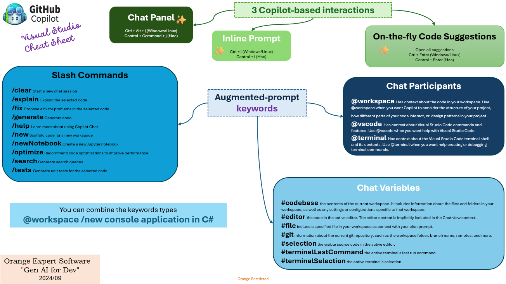
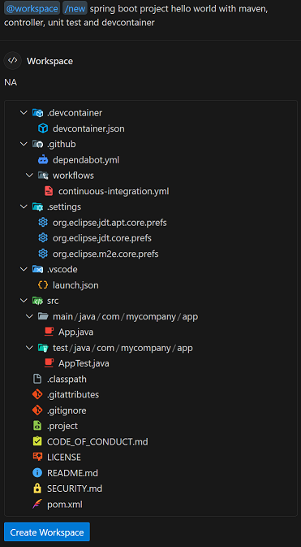
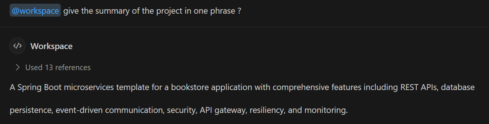

# Github Copilot practices on vscode

## cheat sheat

> 

## some tips

> TIP: __create a project skeleton__
>
> use  **@workspace /new** to scaffold code for a new workspace
>
> example for scaffolding a Spring Boot project:
> 

> TIP: __get information about the project__
>
> use  **@workspace** to get informations about the whole project: structure, architecture, summary...
>
> example of summary for a Spring Boot project:
> 

SUCCESS: __bench copilot__ 