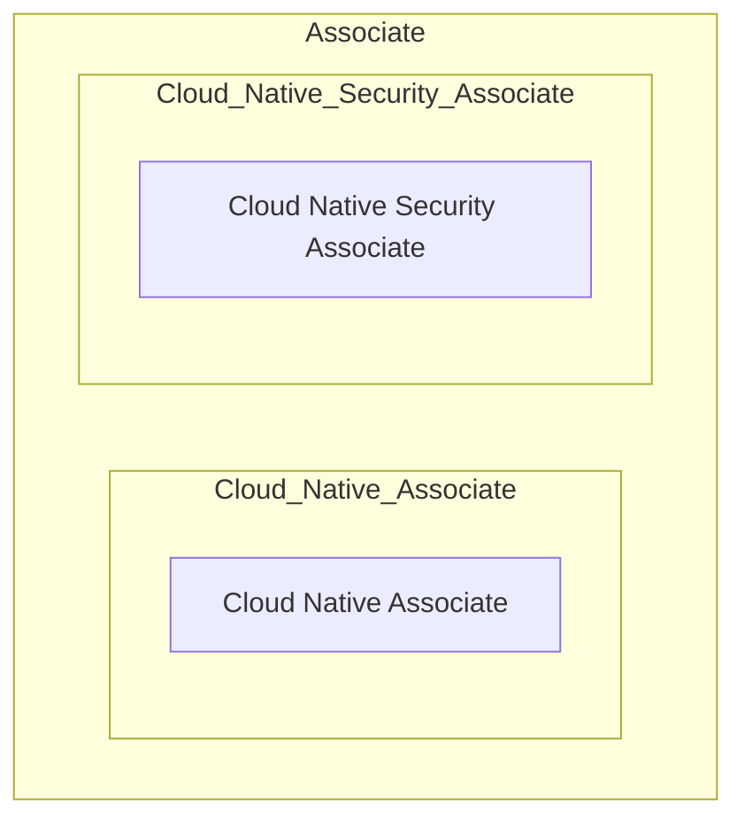
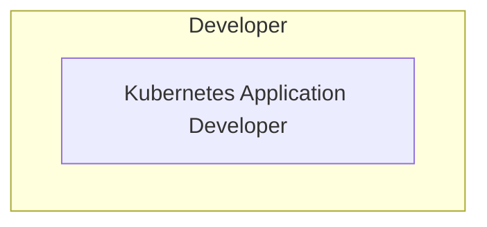
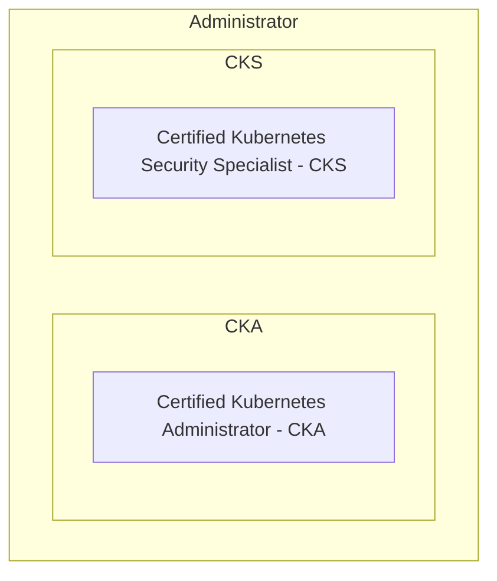

# Certifications

The certifications are designed to validate the ability to use the cloud effectively, which involves technical expertise.

# kubernetes

Kubernetes is becoming the platform for IDP and deployment of cloud-native applications. The Kubernetes certifications are designed to validate the ability to use Kubernetes effectively, which involves technical expertise.

# Kubernetes Certification Learning Path

- the CKS exam and their scoring weights:

| Section                                   | Percentage |
|-------------------------------------------|------------|
| Cluster Setup                             | 10%        |
| Cluster Hardening                         | 15%        |
| System Hardening                          | 15%        |
| Minimize Microservice Vulnerabilities     | 20%        |
| Supply Chain Security                     | 20%        |
| Monitoring, Logging, and Runtime Security | 20%        |

