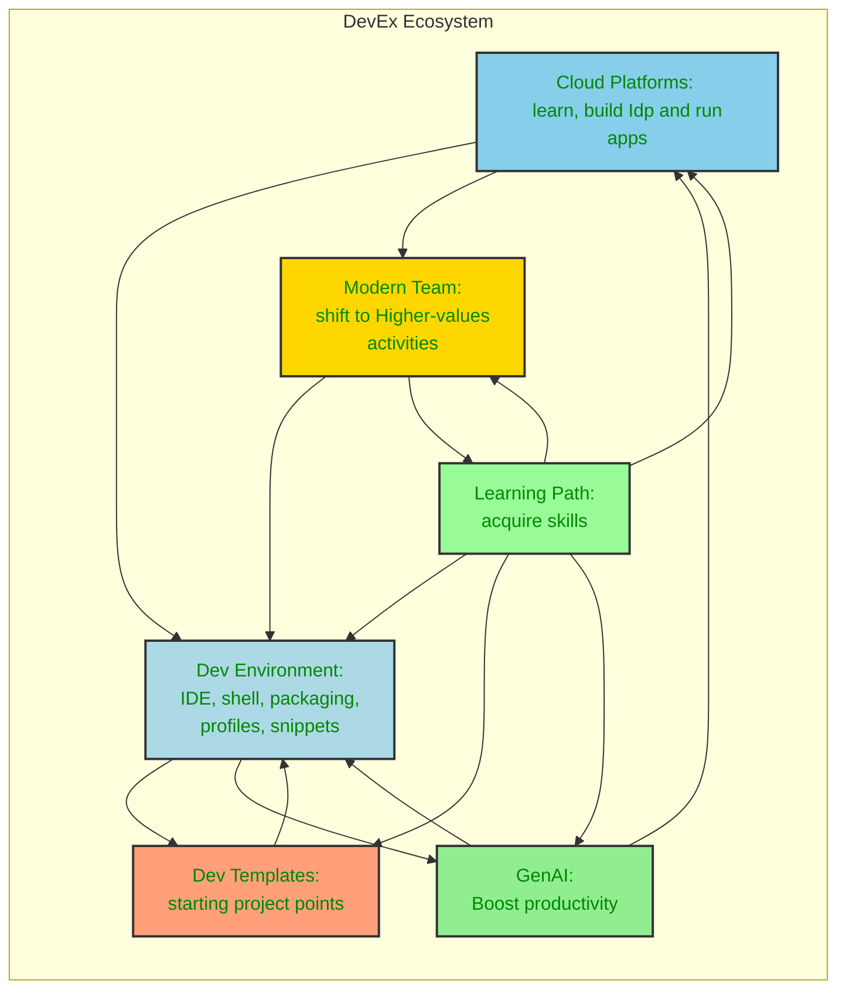

# How to succeed in devex

# The DevEx Ecosystem

The following elements are essential for a adopting a Modern Developer Experience (DevEx) within a cloud-native environment.

```mermaid
graph LR
    subgraph DevEx Ecosystem
        A[Cloud Platforms: <br> learn, build Idp and run apps]
        B[Learning Path: <br> acquire skills]
        C[Modern Team: <br> shift to Higher-values<br>activities]
        D[Dev Environment: <br> IDE, shell, packaging,<br>profiles, snippets]
        E[Dev Templates: <br> starting project points]
        F[GenAI: <br> Boost productivity]
    end

    A --> D
    B --> D
    C --> D
    E --> D
    F --> D

    A --> C
    D --> E
    D --> F
    C --> B
    F --> A

    B --> A 
    B --> C 
    B --> E
    B --> F

  style A fill:#87CEEB,stroke:#333,stroke-width:2px,color:#080
  style B fill:#98FB98,stroke:#333,stroke-width:2px,color:#080
  style C fill:#FFD700,stroke:#333,stroke-width:2px,color:#080
  style D fill:#ADD8E6,stroke:#333,stroke-width:2px,color:#080
  style E fill:#FFA07A,stroke:#333,stroke-width:2px,color:#080
  style F fill:#90EE90,stroke:#333,stroke-width:2px,color:#080
```  

