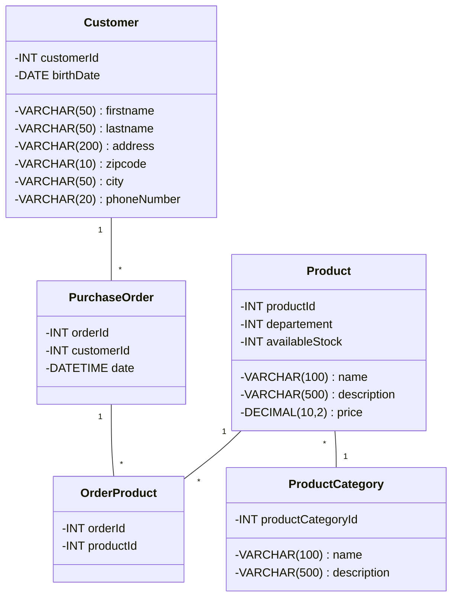
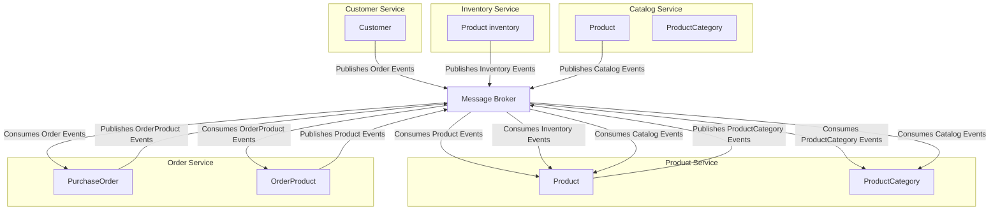
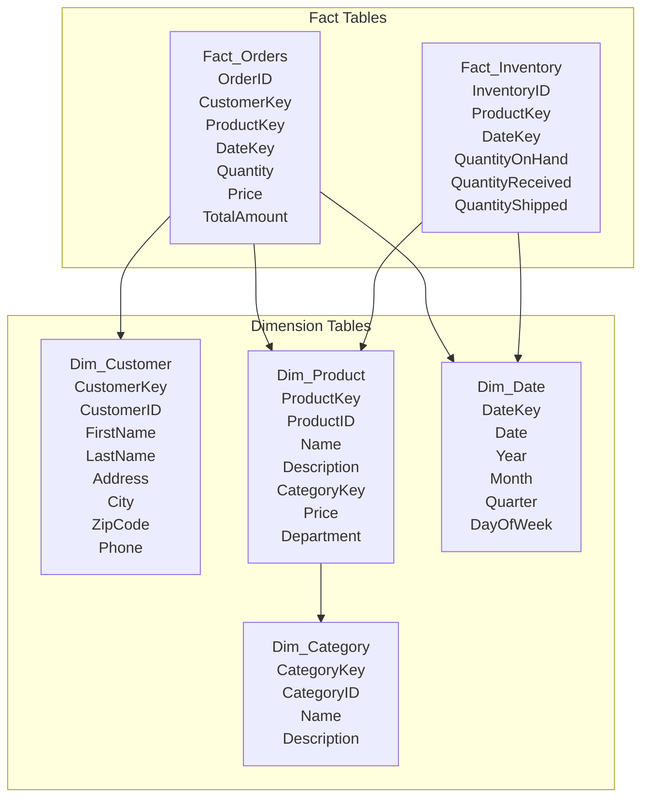
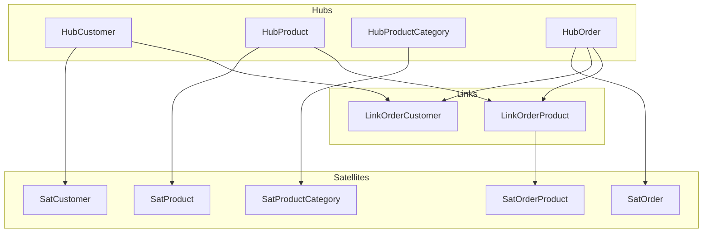

# data modeling


# 

We have a database with the following tables:




# HAVING
 
Donner la requête pour fournir la liste du nombre de clients (customer) par ville (city). Seules les villes qui comptent deux clients ou plus doivent être sélectionnées.

N'afficher que les colonnes CITY et CUSTOMER_COUNT dans cet ordre.
 
Exemple de sortie :
```
--------------------------------
| CITY        | CUSTOMER_COUNT |
--------------------------------
| Boston      | 8              |
| New Delhi   | 2              |
--------------------------------
```

```sql
SELECT 
    city AS CITY, 
    COUNT(customerId) AS CUSTOMER_COUNT
FROM 
    Customer
GROUP BY 
    city
HAVING 
    COUNT(customerId) >= 2
ORDER BY 
    CUSTOMER_COUNT DESC;
```

## Explication :

```sql
SELECT: Sélectionne les colonnes city et le nombre de clients (COUNT(customerId)).
FROM: Indique la table Customer.
GROUP BY: Regroupe les résultats par city.
HAVING: Filtre les groupes pour ne garder que ceux ayant un nombre de clients (COUNT(customerId)) supérieur ou égal à 2.
ORDER BY: Trie les résultats par CUSTOMER_COUNT en ordre décroissant (optionnel).
```

## Jointure multiple

la requête pour sélectionner uniquement les ids des clients (customer) ayant acheté au moins un produit dans la catégorie "Books" ou "Garden" (product_category). La sortie ne doit contenir aucun doublon et doit être triée par ordre croissant.


```sql
SELECT DISTINCT
    c.customerId AS CUSTOMER_ID
FROM
    Customer c
JOIN
    PurchaseOrder po ON c.customerId = po.customerId
JOIN
    OrderProduct op ON po.orderId = op.orderId
JOIN
    Product p ON op.productId = p.productId
JOIN
    ProductCategory pc ON p.productCategoryId = pc.productCategoryId
WHERE
    pc.name IN ('Books', 'Garden')
ORDER BY
    CUSTOMER_ID ASC;
```


```sql
SELECT DISTINCT: Sélectionne les ids des clients sans doublons.
FROM: Indique la tab Customer avec l alias c.
JOIN: Effectue des jointures entre les tables Customer, PurchaseOrder, OrderProduct, Product, et ProductCategory pour relier les informations nécessaires.
WHERE: Filtre les résultats pour ne garder que les produits appartenant aux catégories "Books" ou "Garden".
ORDER BY: Trie les résultats par CUSTOMER_ID en ordre croissant.
```


# DDD


en utilisant l'architecture DDD (Domain-Driven Design) avec des microservices, on peut diviser les responsabilités en plusieurs microservices. Voici une suggestion de découpage en microservices :

1. Customer Service
Responsabilité: Gérer les informations des clients.
Tables: Customer
Fonctionnalités:
CRUD des clients
Gestion des adresses et des informations de contact
2. Product Service
Responsabilité: Gérer les informations des produits.
Tables: Product, ProductCategory
Fonctionnalités:
CRUD des produits
Gestion des catégories de produits
Gestion des stocks
3. Order Service
Responsabilité: Gérer les commandes des clients.
Tables: PurchaseOrder, OrderProduct
Fonctionnalités:
Création et gestion des commandes
Association des produits aux commandes
Suivi des statuts des commandes
4. Inventory Service
Responsabilité: Gérer les stocks des produits.
Tables: Product (pour la gestion des stocks)
Fonctionnalités:
Suivi des niveaux de stock
Mise à jour des stocks après les commandes
5. Catalog Service
Responsabilité: Gérer le catalogue des produits.
Tables: Product, ProductCategory
Fonctionnalités:
Recherche et affichage des produits
Gestion des descriptions et des prix des produits




# star schema



## tables

```sql
-- Dimension Tables
CREATE TABLE Dim_Customer (
    CustomerKey INT PRIMARY KEY,
    CustomerID VARCHAR(50),
    FirstName VARCHAR(50),
    LastName VARCHAR(50),
    Address VARCHAR(100),
    City VARCHAR(50),
    ZipCode VARCHAR(10),
    Phone VARCHAR(20)
);

CREATE TABLE Dim_Category (
    CategoryKey INT PRIMARY KEY,
    CategoryID VARCHAR(50),
    Name VARCHAR(50),
    Description VARCHAR(200)
);

CREATE TABLE Dim_Product (
    ProductKey INT PRIMARY KEY,
    ProductID VARCHAR(50),
    Name VARCHAR(100),
    Description VARCHAR(200),
    CategoryKey INT FOREIGN KEY REFERENCES Dim_Category(CategoryKey),
    Price DECIMAL(10,2),
    Department VARCHAR(50)
);

CREATE TABLE Dim_Date (
    DateKey INT PRIMARY KEY,
    Date DATE,
    Year INT,
    Month INT,
    Quarter INT,
    DayOfWeek INT
);

-- Fact Tables
CREATE TABLE Fact_Orders (
    OrderID INT,
    CustomerKey INT FOREIGN KEY REFERENCES Dim_Customer(CustomerKey),
    ProductKey INT FOREIGN KEY REFERENCES Dim_Product(ProductKey),
    DateKey INT FOREIGN KEY REFERENCES Dim_Date(DateKey),
    Quantity INT,
    Price DECIMAL(10,2),
    TotalAmount DECIMAL(10,2)
);

CREATE TABLE Fact_Inventory (
    InventoryID INT,
    ProductKey INT FOREIGN KEY REFERENCES Dim_Product(ProductKey),
    DateKey INT FOREIGN KEY REFERENCES Dim_Date(DateKey),
    QuantityOnHand INT,
    QuantityReceived INT,
    QuantityShipped INT
);
```

# Data Vault 2.0

To model the data in a Data Vault 2.0 architecture, we need to create Hubs, Links, and Satellites. Here’s how you can model the tables based on the services emitting events to a data warehouse:



## hubs:

Hubs
Hubs represent the core business entities and contain unique business keys.

HubCustomer

Customer_HK (Hash Key)
Customer_BK (Business Key, e.g., Customer ID)
LoadDate (Load Date)
RecordSource (Source of the record)
HubProduct

Product_HK
Product_BK (e.g., Product ID)
LoadDate
RecordSource
HubProductCategory

ProductCategory_HK
ProductCategory_BK (e.g., Product Category ID)
LoadDate
RecordSource
HubOrder

Order_HK
Order_BK (e.g., Order ID)
LoadDate
RecordSource


## Links
Links represent the relationships between the hubs.

LinkOrderCustomer

OrderCustomer_LK (Link Key)
Order_HK
Customer_HK
LoadDate
RecordSource
LinkOrderProduct

OrderProduct_LK
Order_HK
Product_HK
LoadDate
RecordSource


## Satellites
Satellites store the descriptive attributes of the hubs and links.

SatCustomer

Customer_HK
FirstName
LastName
BirthDate
Address
ZipCode
City
PhoneNumber
LoadDate
RecordSource
SatProduct

Product_HK
Department
Name
Description
Price
AvailableStock
LoadDate
RecordSource
SatProductCategory

ProductCategory_HK
Name
Description
LoadDate
RecordSource
SatOrder

Order_HK
Customer_HK
Date
LoadDate
RecordSource
SatOrderProduct

OrderProduct_LK
Order_HK
Product_HK
LoadDate
RecordSource


