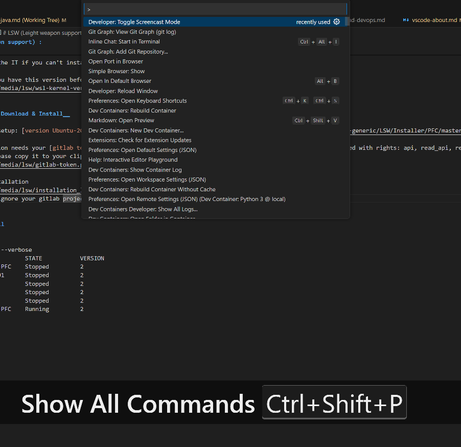
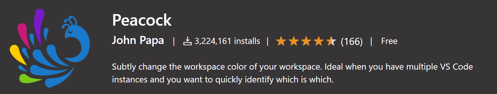
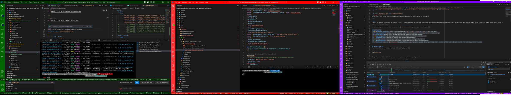

# Visual Studio Code

> Visual Studio Code (vscode) is
>
> - a lightweight but powerful code editor
> - a free, open-source code editor developed by Microsoft for Windows, Linux, and macOS. It includes support for debugging, embedded Git control, syntax highlighting, intelligent code completion, snippets, and code refactoring.
>
> check [workstation / software / code-editor](./environment/softwares.md/#code-editor) for altenatives.

> TIP: __use vscode in WSL/LSW__
> The [WSL extension](https://marketplace.visualstudio.com/items?itemName=ms-vscode-remote.remote-wsl) installed by default with [LSW](../environment/lsw.md) lets you use VS Code on Windows to build Linux applications that run on the Windows Subsystem for Linux (WSL).

> TIP: __open a project in WSL/LSW ?__ 

> TIP: __essential commands in vscode__
>
> - The command palette contains all commands accessible through "CTRL+SHIFT+P".
>   
>
> - Here are some essential commands for developing in vscode:
>   - __Terminal: New Terminal__: Opens a new integrated terminal.
>   - __Developer: Reload Window__: This command reloads the entire Visual Studio Code window, useful when you need to apply changes or troubleshoot issues.
>   - __File: New File__: Creates a new file in the current workspace.
>   - __File: Open File__: Opens an existing file in the current workspace.
>   - __File: Save__: Saves the current file.
>   - __Edit: Undo__: Undoes the last action.
>   - __Edit: Redo__: Redoes the last undone action.
>   - __View: Toggle Sidebar__: Toggles the visibility of the sidebar.
>   - __View: Toggle Terminal__: Toggles the visibility of the integrated terminal.
>   - __Selection: Expand Selection__: Expands the current selection to the next logical boundary.
>   - __Selection: Shrink Selection__: Shrinks the current selection to the previous logical boundary.
>   - __Search: Find__: Opens the search panel to find text in the current file.
>   - __Search: Replace__: Opens the search panel to find and replace text in the current file.
>   - __Terminal: Run Task__: Runs a task defined in the workspace.
>   - __Terminal: Clear__: Clears the terminal.
>   - __Debug: Start Debugging__: Starts the debugging session for the current workspace.
>   - __Extensions: Show Installed Extensions__: Shows a list of installed extensions.
>   - __Extensions: Install Extension__: Opens the extension marketplace to install new extensions.
>   - __Extensions: Update All Extensions__: Updates all installed extensions.
>   - __Preferences: Open Settings__: Opens the settings file for customization.
>   - __Preferences: Keyboard Shortcuts__: Opens the keyboard shortcuts file for customization.
>   - __Preferences: Color Theme__: Changes the color theme of the editor.
>
> Feel free to explore more commands and customize Visual Studio Code according to your needs!

> TIP: __open the terminal under vscode__
> The terminal appear at the bottom of the Visual Studio Code window with settings. It will open in a panel, allowing you to execute commands and interact with your project's files and directories.
> 

> TIP: __change the color theme in vscode__
> - To change the color theme in Visual Studio Code, you can access it through the command palette by selecting "Preferences: Color Theme".
> 
>
> - Additionally, you can explore additional GitHub themes by installing the [extension "GitHub.github-vscode-theme"](https://marketplace.visualstudio.com/items?itemName=GitHub.github-vscode-theme).

> TIP: __Use color for multiple vscode instances/profiles__
> - To change workspace color of your workspace. when you have multiple VS Code instances/profiles, use the peacock extension [extension "johnpapa.vscode-peacock"](https://marketplace.visualstudio.com/items?itemName=johnpapa.vscode-peacock).
> 
> - You can quickly identify your editor:
> 
